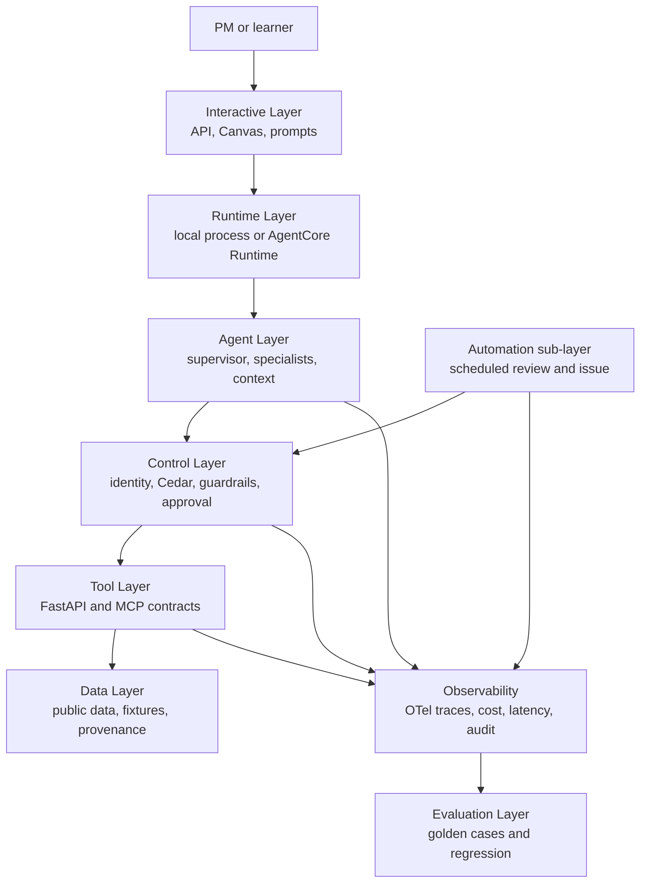
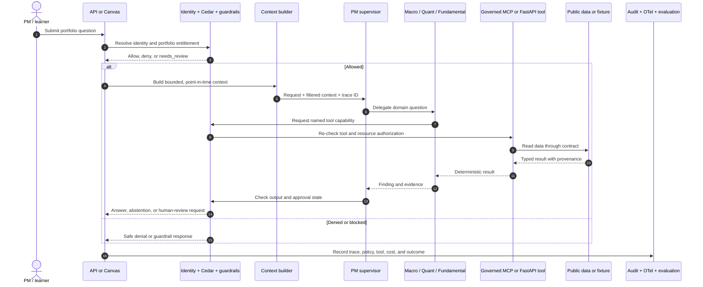
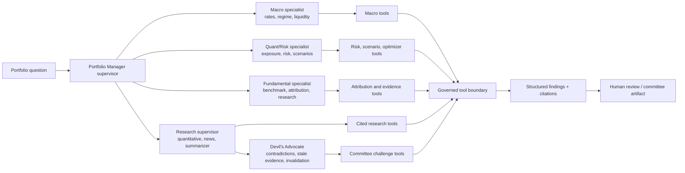
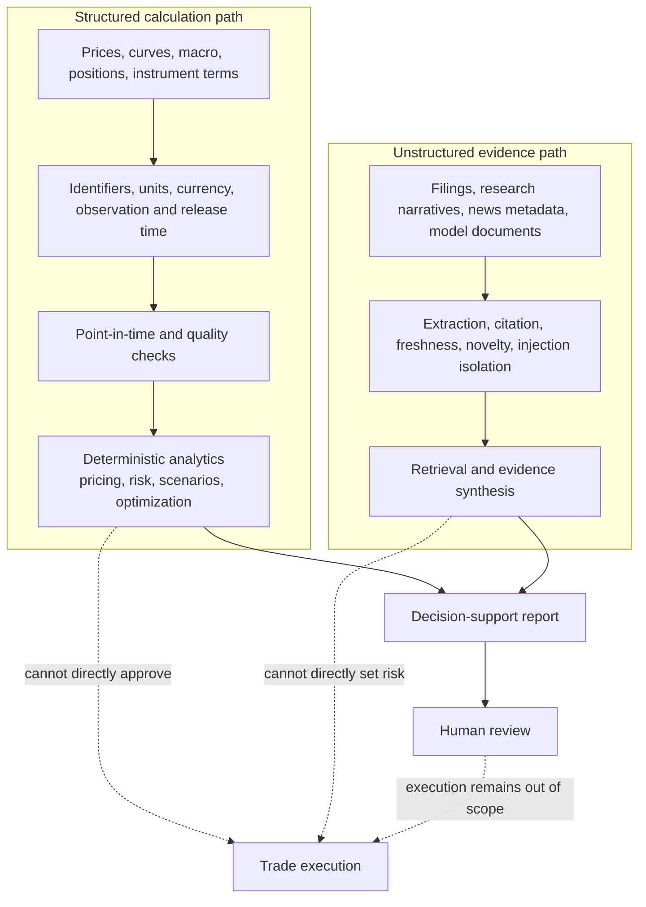
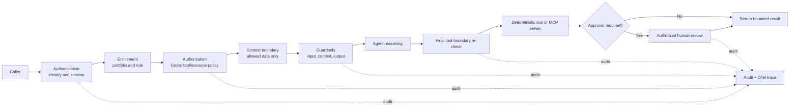
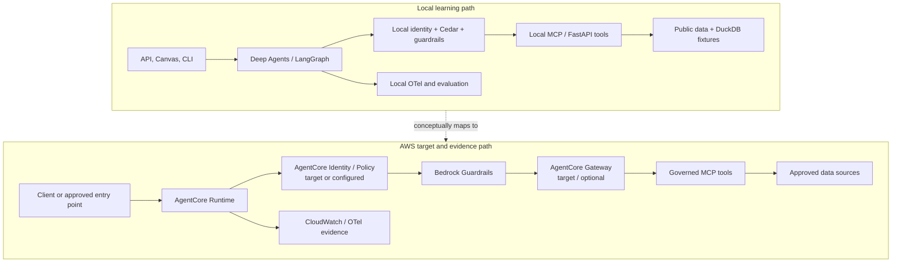
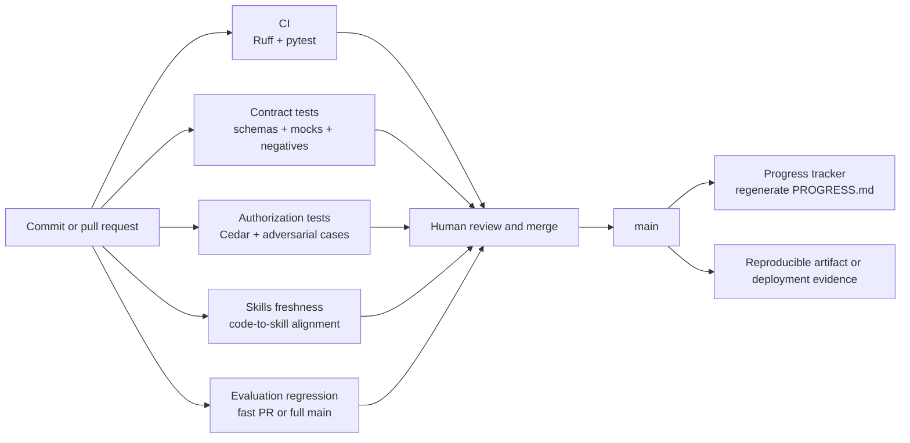
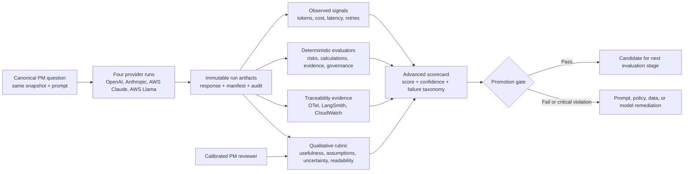

# Architecture Diagrams

This document is the visual companion to [`ARCHITECTURE.md`](ARCHITECTURE.md).
The diagrams use Mermaid so they remain editable, reviewable, and renderable in
GitHub. The diagrams describe the current learning-platform design; they do
not imply that every target service or live provider is enabled.

## How to read these diagrams

Read them in this order:

1. Platform layers: where capabilities belong.
2. Request sequence: how one governed request moves through the system.
3. Agent orchestration: how the supervisor delegates work.
4. Data and evidence: what can support calculations versus explanation.
5. Governance: where authority is checked.
6. Deployment comparison: what is local, AWS-backed, or still intended.
7. CI and evaluation: how changes are checked before and after merge.

> **Evidence boundary:** a box labeled `target`, `optional`, or `fixture` is a
> design or learning path, not proof of a live integration. Refer to
> [`EVIDENCE.md`](../evidence/EVIDENCE.md) and [`PROGRESS.md`](../../PROGRESS.md) for evidence.

## 1. Platform layers and trust boundaries

This is the high-level architecture. The Control Layer is deliberately separate
from model reasoning, and the Tool Layer is where deterministic calculations
are exposed through contracts and governed adapters.

Key boundary: skills, prompts, and model output may request an action, but only
the Control Layer and final tool boundary can authorize it.

## 2. End-to-end governed request

This sequence shows the normal read-only PM request path. A request can end in
an answer, an abstention, a denial, or human review; it does not become a trade
instruction automatically.

## 3. Multi-agent orchestration

The supervisor coordinates specialists with restricted tool sets. Specialists
do not receive unrestricted access to the entire analytics layer, and the
supervisor does not treat a narrative response as a substitute for a tool
result.

## 4. Structured data and unstructured evidence

The platform keeps numerical calculation inputs and narrative evidence on
separate paths. This reduces the risk that an extracted sentence silently
becomes a price, risk number, allocation, or execution instruction.

## 5. Governance and security boundaries

These checks are independent. Authentication identifies the caller; it does
not authorize a tool. Guardrails inspect content; they do not replace policy.
The final tool boundary re-checks authority even when an upstream agent or
Canvas surface has already made a decision.

## 6. Local and AWS deployment comparison

The local path is the primary reproducible learning environment. The AWS path
demonstrates a managed runtime boundary, but optional or account-dependent
components must not be represented as live evidence until they are exercised
and recorded.

The AWS setup and teardown procedure is documented in
[`AWS_AGENTCORE_SETUP.md`](../guides/AWS_AGENTCORE_SETUP.md). A Runtime reaching `READY`
is deployment evidence, not proof that a complete application request succeeded.

## 7. Pull request, evaluation, and release flow

The repository separates code correctness, contract correctness, authorization,
skill freshness, and agent behavior quality into focused GitHub Actions checks.

See [`GITHUB_WORKFLOWS.md`](../guides/GITHUB_WORKFLOWS.md) for exact triggers,
permissions, local equivalents, and troubleshooting.

## 8. Advanced benchmark evaluation and evidence flow

The original four-model comparison remains the operational baseline. The
advanced scorecard adds deterministic expected-result checks, repeated-run
statistics, qualitative review, and evidence links without overwriting any
baseline response or trace artifact.

The scorecard distinguishes automated facts from reviewer judgment. A model
cannot pass promotion with a critical governance failure even if it is cheaper
or faster. Run-level evidence is browsable from
[`INSTITUTIONAL_PM_EVALUATION_SCORECARD.md`](../learning/INSTITUTIONAL_PM_EVALUATION_SCORECARD.md),
while the original baseline remains in
[`CANONICAL_PM_BENCHMARK_REPORT.md`](../learning/CANONICAL_PM_BENCHMARK_REPORT.md).
Scorecard v2 adds the scenario manifest in
`experiments/canonical-pm-benchmark/scenarios/`, repeated-run analysis, p50/p95
latency and variance, and the promotion thresholds in
`config/evaluation-gates.yaml`. Planned scenarios are not counted as observed
evidence.

## Related implementation paths

| Diagram | Primary source of truth |
|---|---|
| Platform layers and security | [`ARCHITECTURE.md`](ARCHITECTURE.md) |
| Request and agent flow | [`src/agents/`](../../src/agents/), [`src/control/`](../../src/control/) |
| Structured and unstructured data | [`data/README.md`](../../data/README.md), [`src/ingestion/`](../../src/ingestion/), [`src/research/`](../../src/research/) |
| Evaluation and operations | [`src/observability/`](../../src/observability/), [`evals/`](../../evals/), [`experiments/README.md`](../../experiments/README.md) |
| AWS deployment | [`AWS_AGENTCORE_SETUP.md`](../guides/AWS_AGENTCORE_SETUP.md), [`config/agentcore.yaml`](../../config/agentcore.yaml) |
| GitHub Actions | [`GITHUB_WORKFLOWS.md`](../guides/GITHUB_WORKFLOWS.md), [`../../.github/workflows/`](../../.github/workflows/) |
